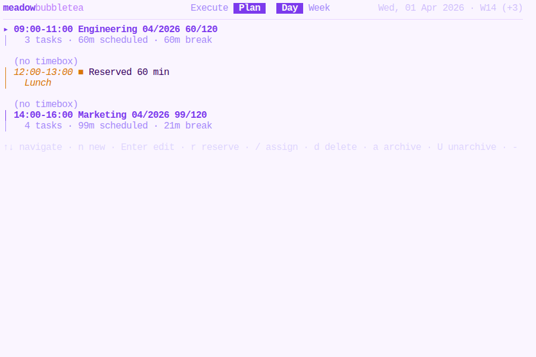
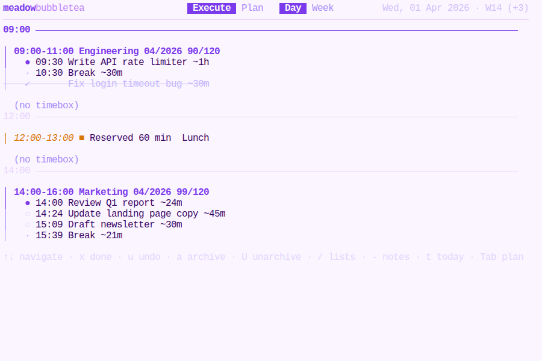
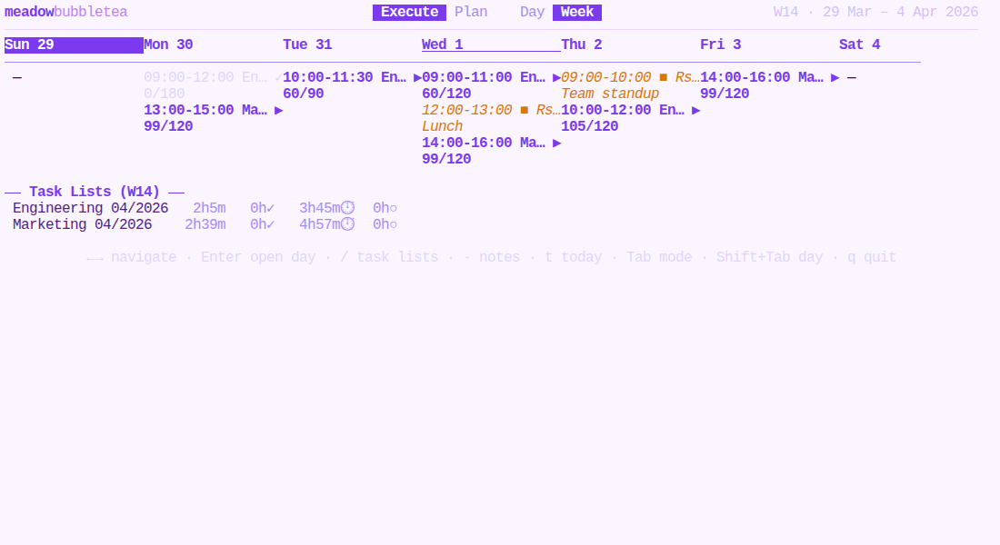
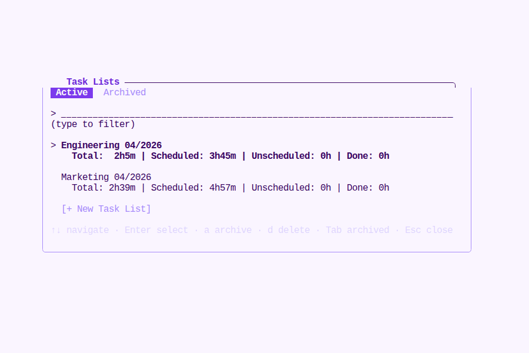
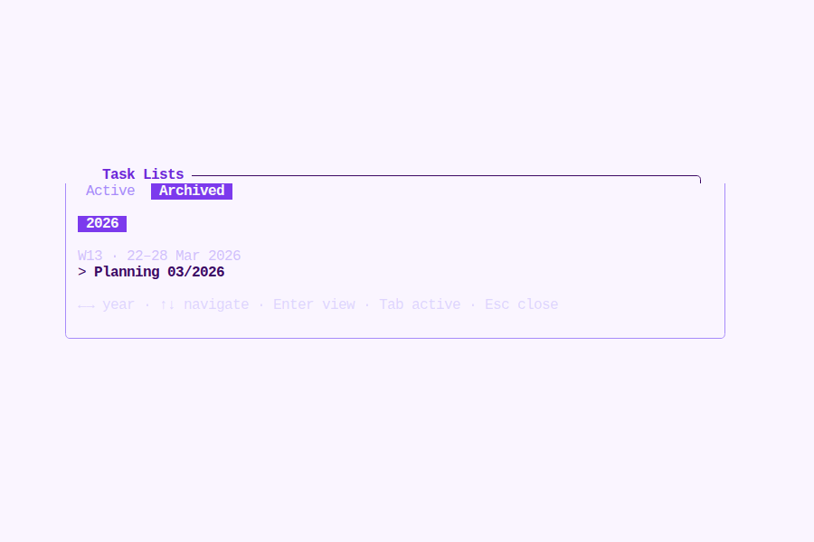
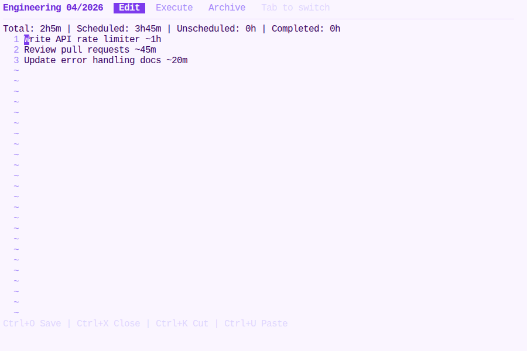
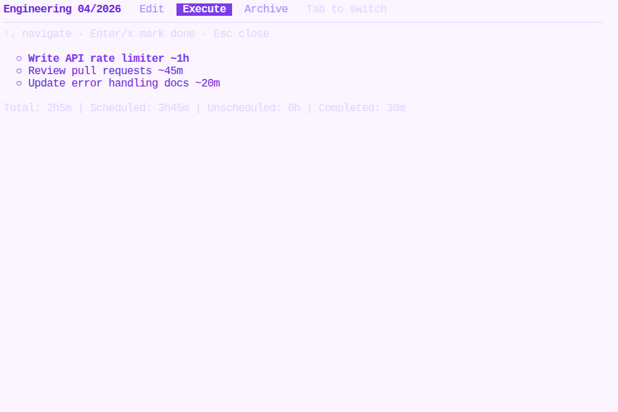
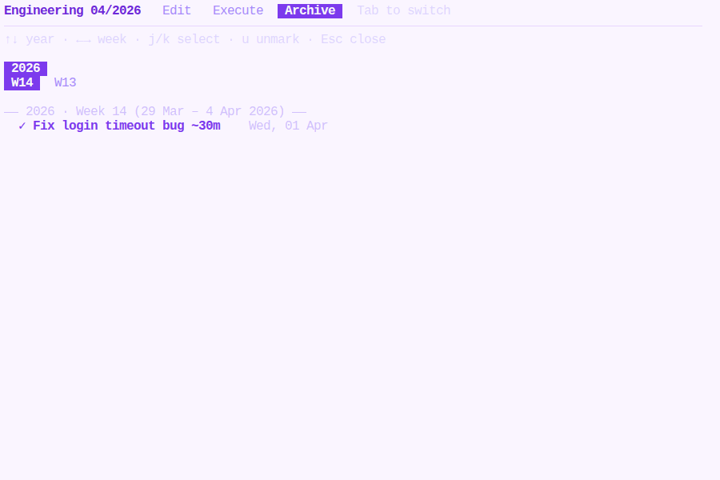

# Using the TUI

## Modes and Views

The TUI has two **modes** and two **views**, giving you four combinations:

|              | Day                    | Week                  |
|--------------|------------------------|-----------------------|
| **Execute**  | Work through tasks     | Week overview         |
| **Plan**     | Create/edit timeboxes  | Week overview         |

- Press `Tab` to switch between **Execute** and **Plan** mode.
- Press `Shift+Tab` to switch between **Day** and **Week** view.

The current mode and view are shown in the header.

## Day View: Planning Your Day

Switch to **Plan** mode (`Tab`) in **Day** view:

1. **Create a timebox** — press `n`, then type the time range (e.g. `09:00-11:00`) and press `Enter`. Timeboxes must be at least 15 minutes and cannot overlap.
2. **Assign a task list** — select the timebox with `Up`/`Down`, press `/` to open the task list picker, type to filter, and press `Enter` to assign.
3. **Edit timebox times** — select a timebox and press `Enter`, then type new times.
4. **Delete a timebox** — select a timebox and press `d`, then confirm with `y`.
5. **Reserve a time block** — select an unassigned timebox and press `r` to mark it as reserved (for meetings, breaks, focus time). You'll be prompted for an optional note. Press `r` again to unreserve.

Reserved timeboxes cannot have task lists assigned to them. They appear with a filled square marker (■) and amber styling.

Navigate between days with `Left`/`Right`. Jump to today with `t`.

## Day View: Executing Tasks

Switch to **Execute** mode (`Tab`) in **Day** view:

- Tasks from the assigned list are sequenced into each timebox automatically. If a task doesn't fit in the remaining time, a break is inserted.
- Press `x` to mark the current task as done. It moves to the completed section and is removed from the task list.
- Press `u` to undo the most recently completed task in the selected timebox. The task is restored to the task list.
- Press `a` to archive a completed timebox. Completed tasks are recorded in the weekly archive. If there are pending tasks, you'll be asked to confirm.
- Press `U` to unarchive a previously archived timebox. The timebox is reactivated; completed tasks remain in the archive.

## Week View

Press `Shift+Tab` to see the week overview. It shows a seven-column grid with one column per day (Sunday through Saturday):

- Each timebox is shown with its time range, assigned list name (or "■ Rsvd" for reserved), and a status indicator (▶ active, ✓ archived).
- Below the grid, a **Task Lists** section shows all lists with weekly stats: total time, completed, scheduled, and unscheduled.

Navigate days with `Left`/`Right`. Press `Enter` to jump into a specific day's Day view. Press `t` to jump to today.

Weeks start on **Sunday**. Week 1 of a year is the week containing 1 January.

## Task List Menu

Press `/` from any main view to open the task list picker overlay.

### Active Tab

The default tab shows all active task lists:

- **Type to filter** — case-insensitive substring match on list names.
- **Select a list** — `Up`/`Down` to navigate, `Enter` to select. In Plan mode with an unassigned timebox, this assigns the list. Otherwise, it opens the task list editor.
- **Create a new list** — arrow down to `[+ New Task List]` and press `Enter`, then type the name.
- **Archive a list** — press `a` on the selected list. Only allowed if the list is not assigned to any active timebox. The list is moved to `archive/{YYYY}/{WW}/tasklists/`.
- **Delete a list** — press `d` on the selected list. Only allowed if the list has no completed tasks in any archive week and is not assigned to an active timebox.

### Archived Tab

Press `Tab` to switch to the Archived tab:

- **Year pills** at the top — `Left`/`Right` to navigate between years.
- **Week headers** with date ranges (e.g. `W13 · 22–28 Mar 2026`).
- **Archived lists** grouped by week, sorted alphabetically.
- Press `Enter` to open an archived list in read-only Archive mode.

| Key | Action | Tab |
|-----|--------|-----|
| Type | Filter lists by name | Active |
| `Up` / `Down` | Navigate list | Both |
| `Enter` | Select / view list | Both |
| `a` | Archive selected list | Active |
| `d` | Delete selected list | Active |
| `Tab` | Switch Active / Archived tab | Both |
| `Left` / `Right` | Navigate year pills | Archived |
| `Esc` | Close menu | Both |

## Task List Editor

Select a list from the menu and press `Enter` (or select it in Execute mode) to open the full-screen editor. The editor has three sub-modes, cycled with `Tab`:

### Edit Mode

A nano-like text editor for the raw task list:

- Each line is one task in the format: `Description ~duration` (e.g. `Review report ~24m`)
- Lines starting with `#` are comments (excluded from scheduling)
- Duration formats: `~24m`, `~1h30m`, `~2h`

### Execute Mode

Mark tasks as done from within the editor:

- `Up`/`Down` to navigate tasks
- `Enter` or `x` to mark the selected task as done
- Stats are shown at the bottom (total, scheduled, unscheduled, completed)

### Archive Mode

Browse completed tasks grouped by year and week:

- `Up`/`Down` to navigate year pills
- `Left`/`Right` to navigate week pills
- `j`/`k` to select individual completed tasks
- `u` to unmark (restore) a completed task back to the active list

When viewing an archived task list (opened from the Archived tab), Archive mode is **read-only** — the `u` (unmark) key is disabled and a `(read-only)` label is shown.

### Editor Shortcuts

| Key | Action |
|-----|--------|
| `Tab` | Cycle sub-mode (Edit / Execute / Archive) |
| `Ctrl+O` | Save |
| `Ctrl+X` | Close |
| `Ctrl+K` | Cut line |
| `Ctrl+U` | Paste line |
| `Esc` | Close (prompts to save if modified) |

## Global Notes

Press `-` from any view to open a full-screen editor for your global notes file (`DATA/notes.md`). The editor uses the same controls as the task list editor (Ctrl+O to save, Ctrl+X or Esc to close).

## Keyboard Reference

### Main View

| Key | Action | Context |
|-----|--------|---------|
| `Tab` | Toggle mode (Execute / Plan) | All views |
| `Shift+Tab` | Toggle view (Day / Week) | All views |
| `Left` / `Right` | Navigate days or weekdays | All views |
| `Up` / `Down` | Navigate timeboxes | Day view |
| `t` | Jump to today | All views |
| `/` | Open task list menu | All views |
| `-` | Open global notes editor | All views |
| `Enter` | Enter day (Week); edit times (Plan+Day) | Week / Plan+Day |
| `n` | Create new timebox | Plan mode, Day view |
| `d` | Delete timebox | Plan mode, Day view |
| `r` | Toggle reserved time block | Plan mode, Day view |
| `x` | Mark current task done | Execute mode, Day view |
| `u` | Undo most recent done task | Execute mode, Day view |
| `a` | Archive timebox | Day view |
| `U` | Unarchive timebox | Day view |
| `q` / `Ctrl+C` | Quit | All views |

### Task List Menu

| Key | Action |
|-----|--------|
| Type | Filter lists by name |
| `Up` / `Down` | Navigate list |
| `Enter` | Select list |
| `a` | Archive list (Active tab) |
| `d` | Delete list (Active tab) |
| `Tab` | Switch Active / Archived tab |
| `Left` / `Right` | Navigate year pills (Archived tab) |
| `Esc` | Close menu |

### Task List Editor

| Key | Action |
|-----|--------|
| `Tab` | Cycle sub-mode (Edit / Execute / Archive) |
| `Ctrl+O` | Save |
| `Ctrl+X` | Close |
| `Ctrl+K` | Cut line |
| `Ctrl+U` | Paste line |
| `Up` / `Down` | Navigate tasks (Execute); navigate years (Archive) |
| `Left` / `Right` | Navigate weeks (Archive) |
| `j` / `k` | Select task (Archive) |
| `x` / `Enter` | Mark task done (Execute) |
| `u` | Unmark task (Archive, active lists only) |
| `Esc` | Close (prompts to save if modified) |
